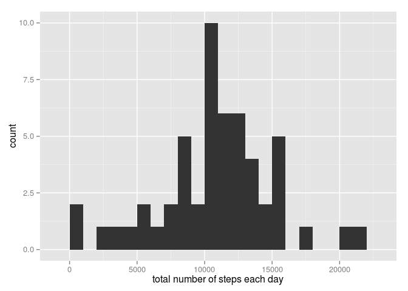
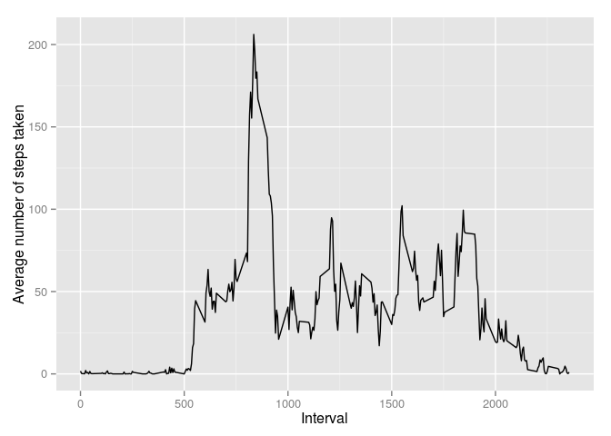
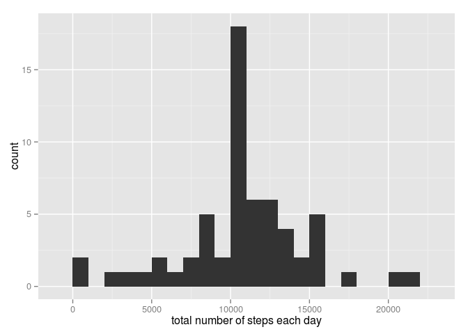
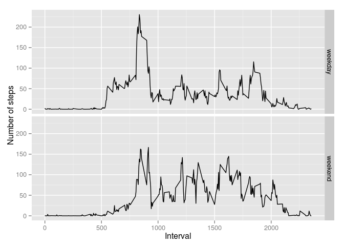

# Reproducible Research: Peer Assessment 1
## Introduction 
In this assignment we have to answer 3 questions:

1. What is the mean total numbers of steps per day

2. What is the average daily activity pattern

3. Are there differences in activity patterns between weekdays and weekends

To answer the questions there is a given dataset called "activities". In this dataset are three variables:

1. steps: Number of steps taking in a 5-minute interval (missing values are coded as NA)

2. date: The date on which the measurement was taken in YYYY-MM-DD format

3. Interval: Identifier for the 5-minute interval in which measurement was taken

The dataset is stored in a comma-separated-value (CSV) file and there are a total of 17,568 observations in this dataset.

## Packages we use
First of all we activate the packages we need to process the data.

```r
library(ggplot2)
```

## Loading and preprocessing the data
The data is available in the same directory as the code so we can unzip it immediatly and read it into a dataframe called "actMonData".

```r
unzip(zipfile="activity.zip")
actMonData <- read.csv('activity.csv')
```
The column date in actMonData is a factor, so we format it as a date.

```r
actMonData$date <- as.Date(actMonData$date)
```

## What is mean total number of steps taken per day?
First we calculate the total steps taken each day.


```r
actAgg <- aggregate(steps ~ date, actMonData, sum)
```

We create a graph displying the total number of steps taken each day.

```r
qplot(actAgg$steps, geom="histogram", binwidth = 1000, xlab = "total number of steps each day")
```

 

Then we can calculate the mean.

```r
cat("The mean of total numbers of steps taken each days is:",mean(actAgg$steps))
```

```
## The mean of total numbers of steps taken each days is: 10766.19
```

The median is calculated also.

```r
cat("The median of total numbers of steps taken each day is:",median(actAgg$steps))
```

```
## The median of total numbers of steps taken each day is: 10765
```

## What is the average daily activity pattern?
First we create an aggregate which holds the average of steps per interval.

```r
intAgg<- aggregate(steps ~ interval, actMonData,mean)
```
Then we make a time series plot (i.e. type = "l") of the 5-minute interval (x-axis) and the average number of steps taken, averaged across all days (y-axis).

```r
ggplot(data=intAgg, aes(x=interval, y=steps)) +
    geom_line() +
    xlab("Interval") +
    ylab("Average number of steps taken")
```

 

Next we determine the interval with the maximum of steps.


```r
cat("The interval with the highest number of steps is number:", intAgg[which.max(intAgg$steps), 1])
```

```
## The interval with the highest number of steps is number: 835
```
## Imputing missing values
There are many missing values, coded as NA, in variable "steps" in the dataset. The missing values effects the correctness of calculation like mean and so on. 

We repair this situation by giving each step with an NA the average of the interval the step belongs to. First of all we figure out how many missing values there are:

```r
cat("The total number of rows with value NA's (i.e. missing values) is:", sum(is.na(actMonData$steps)))
```

```
## The total number of rows with value NA's (i.e. missing values) is: 2304
```
First we create a copy of the dataframe.

```r
newActMon <- actMonData
```
Then we use the aggregate intAgg created in an earlier step to update the missing values with the average value of steps per interval.

```r
newActMon$steps[is.na(newActMon$steps)] <- intAgg[match(newActMon$interval, intAgg$interval),2]
```
For sure we check that missing values are no longer there and that the volume of the dataframe is correct.

```r
cat("The total number of rows with value NA's (i.e. missing values) is:", sum(is.na(newActMon$steps)))
```

```
## The total number of rows with value NA's (i.e. missing values) is: 0
```

```r
cat("the total number of rows is:", nrow(newActMon))
```

```
## the total number of rows is: 17568
```
We want to make a histogram of the total number of steps taken each day and we want to calculate and report the mean and median total number of steps taken per day, to see if there are any differences with the results including missing values.

To do so first we create an aggregate total steps per date of the data without missing values.

```r
newActAgg <- aggregate(steps ~ date, newActMon, sum)
```
Now we can create a histogram of the new data.

```r
qplot(newActAgg$steps, geom="histogram", binwidth = 1000, xlab = "total number of steps each day")
```

 

And then we calculate the mean and median again.

```r
cat("The new mean is:", mean(newActAgg$steps))
```

```
## The new mean is: 10766.19
```

```r
cat("The new median is:", median(newActAgg$steps))
```

```
## The new median is: 10766.19
```

```r
cat("The mean including the rows with missing values was:",mean(actAgg$steps))
```

```
## The mean including the rows with missing values was: 10766.19
```

```r
cat("The median including the rows with missing values was:",median(actAgg$steps))
```

```
## The median including the rows with missing values was: 10765
```
So we see no difference between the mean values, but the median slightly differs.

## Are there differences in activity patterns between weekdays and weekends?
First we create a function which determines if a day is a weekday or a weekend.

```r
weekdayOrWeekend <- function(date) {
    day <- weekdays(date)
    if (day %in% c("Monday", "Tuesday", "Wednesday", "Thursday", "Friday"))
        return("weekday")
    else if (day %in% c("Saturday", "Sunday"))
        return("weekend")
    else
        stop("invalid date")
}
newActMon$date <- as.Date(newActMon$date)
newActMon$day <- sapply(newActMon$date, FUN=weekdayOrWeekend)
```

And then we create the plot to show if there is a difference in the activity pattern between weekdays and weekends.

```r
intDayAgg <- aggregate(steps ~ interval + day, data=newActMon, mean)
ggplot(intDayAgg, aes(x=interval, y=steps)) + geom_line() + facet_grid(day ~ .) +
    xlab("Interval") + ylab("Number of steps")
```

 
